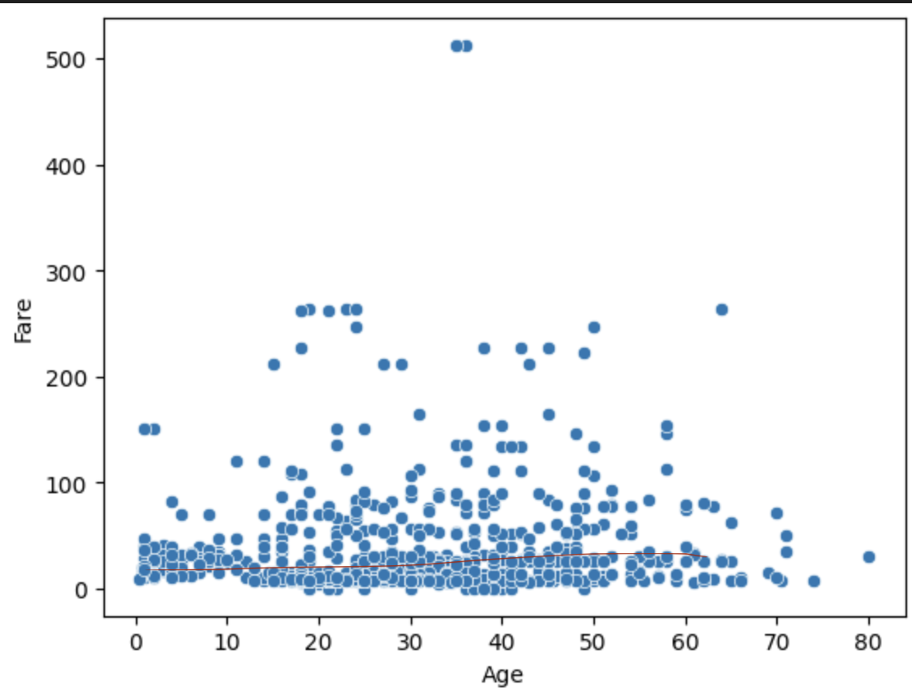

# ML-P101  

## Introducción a Machine Learning con Python
- Docente: Alan Badillo Salas

## Descripción del proyecto

Este repositorio contiene los materiales y ejercicios desarrollados para la práctica
de introducción a Machine Learning utilizando Python.

## Contenido del repositorio

- Scripts de Python
- Configuración del entorno
- Instalacion de librerias

## Resultados del proyecto

- Se creó y activó un entorno virtual en Python.
- Se instalaron los paquetes `pandas` y `seaborn`.
- Se generó un archivo `requirements.txt` para reproducibilidad.
- Se creó y ejecutó una libreta de Jupyter (`test.ipynb`) usando el entorno virtual como kernel.
- Se hizo un primer analisis de dato con la base de titanic de Stanfor usando las librerias de pandas y seanborn (`p101.ipynb`)
- Se verificó la correcta ejecución de código en Jupyter.
- Figura con la linea ajustada. 
### Figura 1. Línea ajustada a los datos

## Autora
**Karla Cruz**  
Práctica 1 del 2026

